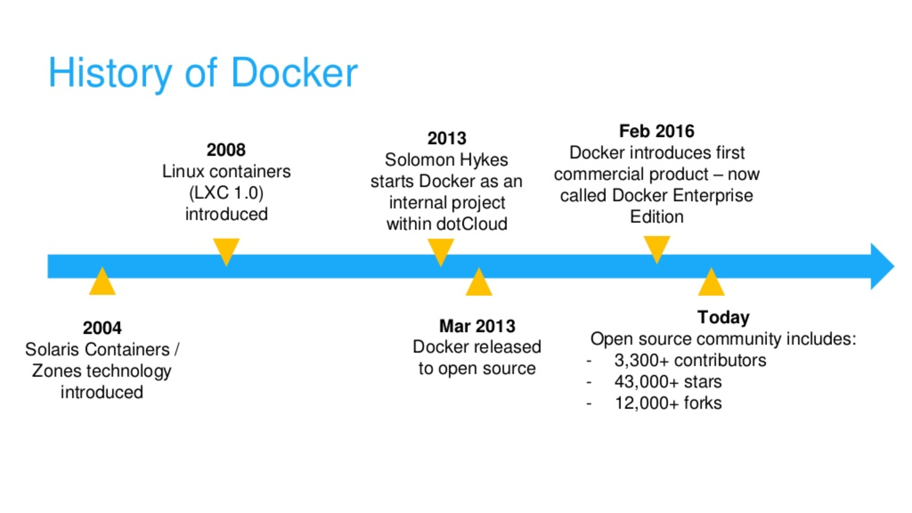

- title : Nie mehr 'works on my machine' - Docker
- description : Nach einem kurzen Einblick soll ein vertiefter Einblick in die technischen Hintergründe und Möglichkeiten von Docker anhand von Beispielen gezeigt werden.
- author : Matthias Dittrich
- theme : sky
- transition : default

```fsharp
[hide]

type EmailAddress = string
type PostalAddress = string
```

***

### Nie mehr 'works on my machine' - Docker


### **Matthias Dittrich**, AIT GmbH <br /> [@matthi\_\_d](http://twitter.com/matthi__d) | [github](https://github.com/matthid) | [aitgmbh.de](http://www.aitgmbh.de/)

***

### Roadmap

 - **Was ist Docker?**
 - Wie erstelle ich images?
 - Was ist Docker Swarm?
 - Netzwerke und Ports?
 - Persistierung und Konfiguration?

---

### Was ist Docker?

"Lightweight VMs" - Container

---

### Warum?


---

### Warum?


---

### Warum?


---

### Warum?


---

### History



---

### Warum?

- Läuft überall
  - Egal welche Kernel-Version
  - Egal welche Distribution
  - Physikalisch, Viruell oder in der Cloud
  - Architektur (x86, x64, ...) muss passen

- Alles läuft
  - Wenn es auf dem Host läuft dann auch im Container
  - Wenn es auf einem Linux Kernel läuft dann auch im Container

---

### Warum?

- High level: Eine einfache VM
  - Eigene Prozesse
  - Eigene Netzwerk-Schnittstellen
  - Eigenes "root"
  - Eigenes `/sbin/init`
  - "Machinencontainer"

- Low level: `chroot` on steroids
  - Benötigt kein eigenes `/sbin/init`
  - Isolierte Prozesse
  - Geteilter Kernel
  - "Anwendungscontainer"

---

### Einschub - Windows Container

- Hat nichts mit "Linux" Containern zu tun
- Eine komplett eigene Implementierung (ähnlich zu neuer "Architektur")
- Selbes Tooling und Konzept

***

### Roadmap

 - Was ist Docker?
 - **Wie erstelle ich images?**
 - Was ist Docker Swarm?
 - Netzwerke und Ports?
 - Persistierung und Konfiguration?

---

### Demo

***

### Thanks / Resources

- [Introduction to Docker](https://www.slideshare.net/Docker/introduction-to-docker-2017)
- [Docker Intro](https://www.slideshare.net/dotCloud/docker-intro-november)
- [Docker Intro](http://pointful.github.io/docker-intro)

***

### Bonus: ClusterManagement

DEMO

***